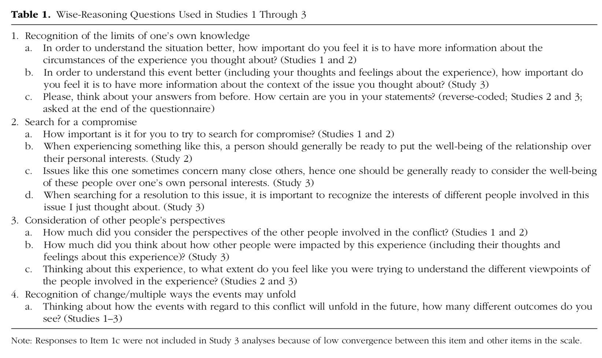
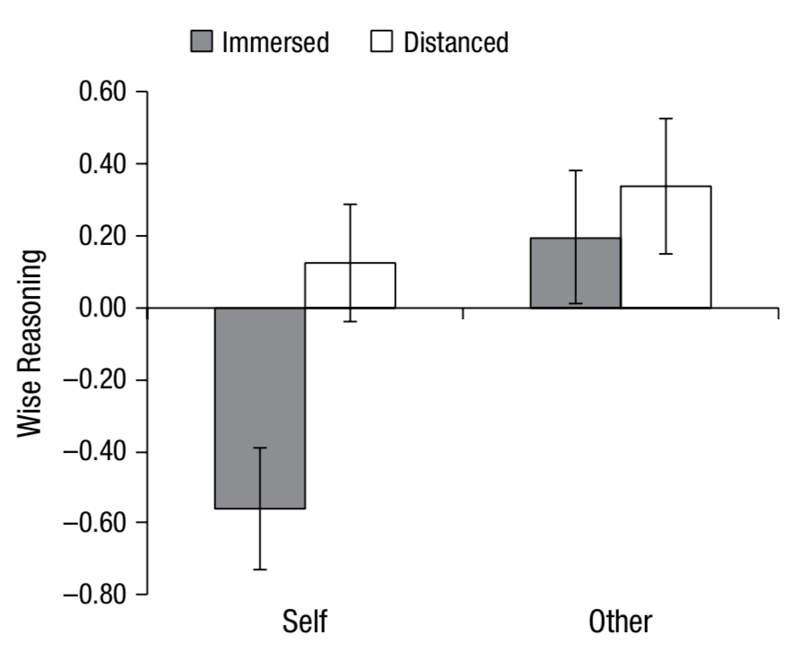

# Report Details

```{r}
articleID <- "8-8-2014_PS" # insert the article ID code here e.g., "10-3-2015_PS"
reportType <- "final" # specify whether this is the 'pilot' report or 'final' report
pilotNames <- "Michael Frank" # insert the pilot's name here e.g., "Tom Hardwicke".  If there are multiple cpilots enter both names in a character string e.g., "Tom Hardwicke, Bob Dylan"
copilotNames <- "Kyle MacDonald" # # insert the co-pilot's name here e.g., "Michael Frank". If there are multiple co-pilots enter both names in a character string e.g., "Tom Hardwicke, Bob Dylan"
pilotTTC <- 120 # insert the pilot's estimated time to complete (in minutes, fine to approximate) e.g., 120
copilotTTC <- 60 # insert the co-pilot's estimated time to complete (in minutes, fine to approximate) e.g., 120
pilotStartDate <- as.Date("06/13/18", format = "%m/%d/%y") # insert the pilot's start date in US format e.g., as.Date("01/25/18", format = "%m/%d/%y")
copilotStartDate <- as.Date("06/13/18", format = "%m/%d/%y") # insert the co-pilot's start date in US format e.g., as.Date("01/25/18", format = "%m/%d/%y")
completionDate <- as.Date("07/21/18", format = "%m/%d/%y") # copilot insert the date of final report completion (after any necessary rounds of author assistance) in US format e.g., as.Date("01/25/18", format = "%m/%d/%y")
```

------

#### Methods summary: 

The goal of this research was to understand the effects of psychological distancing on the ability to make "wise" decisions regarding personal situations. In the target study, Study 2, participants were randomly assigned within a 2x2, between-subjects manipulation (carried out in the lab): they heard about the infidelity of their own partner (self) or a friend's partner (other), then reflected on this and thought about the situation using either first person pronouns (immersed) or names/third-person pronouns (distanced). They then answered a group of "wisdom questions," which were the targets of the main analyses. 

------

#### Target outcomes: 

> We performed planned contrasts, guided by our aims to replicate prior research and extend it by testing the boundary conditions of Solomon’s paradox. To replicate Study 1, we contrasted participants in the self-immersed condition (self-immersion is a chronic tendency in North American samples when thinking about the self; Grossmann & Kross, 2010)—with participants in the other-immersed and other-distanced conditions combined (Contrast 1).3 As Figure 1 illustrates, we replicated the results from Study 1: Participants in the other immersed and other-distanced conditions showed higher levels of wisdom than participants in the self-immersed condition, t(113) = 3.93, p < .001, ηp 2 = .12. Extending prior research on reasoning about societal events (Kross & Grossmann, 2012), we next tested if people in the self distanced condition reasoned more wisely about relationship conflicts than participants in the self-immersed condition (Contrast 2). This was indeed the case (see Fig. 1), t(113) = 2.73, p = .007, ηp 2 = .06. We also tested whether reasoning about other people’s problems benefits from additional distance and found that participants in the other-distanced condition did not differ from participants in the other-immersed conditions (Contrast 3; see Fig. 1), t(113) = 0.56, n.s., ηp 2 = .003; we return to this finding in the General Discussion.

------

```{r global_options, include=FALSE}
# sets up some formatting options for the R Markdown document
knitr::opts_chunk$set(echo=TRUE, warning=FALSE, message=FALSE)
```

# Step 1: Load packages and prepare report object

```{r}
# load packages
library(tidyverse) # for data munging
library(knitr) # for kable table formating
library(haven) # import and export 'SPSS', 'Stata' and 'SAS' Files
library(readxl) # import excel files
library(ReproReports) # custom report functions
library(knitr)
library(plotrix)
library(ggthemes)
library(ez) # for ezANOVA, which often replicates SPSS
```

```{r}
# Prepare report object. This will be updated automatically by the reproCheck function each time values are compared
reportObject <- data.frame(dummyRow = TRUE, reportedValue = NA, obtainedValue = NA, valueType = NA, percentageError = NA, comparisonOutcome = NA, eyeballCheck = NA)
```

# Step 2: Load data

```{r}
d_raw <- read_spss("data/study_2.update.sav")
```

# Step 3: Tidy data

First check number of participants.

> The recruitment strategy was identical to that used in Study 1. The final sample consisted of 120 native-English-speaking University of Michigan students (80 females). 

```{r}
descript <- d_raw %>%
  summarise(n = n(), 
            n_female = sum(gender == 1)) 

descript %>% kable()

reportObject <- reproCheck(reportedValue = "120", obtainedValue = descript$n, valueType = 'n')
reportObject <- reproCheck(reportedValue = "80", obtainedValue = descript$n_female, valueType = 'n')
```

Numbers match. 

Print also by condition so we can check below to ensure tidying did not remove participants. 

```{r}
d_raw %>%
  group_by(code) %>%
  summarise(n = n(), 
            n_female = sum(gender == 1)) %>%
  kable()
```



Questions in this study are (Table 1):

> 1. Recognition of the limits of one’s own knowledge
a. In order to understand the situation better, how important do you feel it is to have more information about the circumstances of the experience you thought about? (Studies 1 and 2) [x]
c. Please, think about your answers from before. How certain are you in your statements? (reverse-coded; Studies 2 and 3; asked at the end of the questionnaire) [x]
2. Search for a compromise
a. How important is it for you to try to search for compromise? (Studies 1 and 2) [x]
b. When experiencing something like this, a person should generally be ready to put the well-being of the relationship over their personal interests. (Study 2) [x]
3. Consideration of other people’s perspectives
a. How much did you consider the perspectives of the other people involved in the conflict? (Studies 1 and 2) [x]
c. Thinking about this experience, to what extent do you feel like you were trying to understand the different viewpoints of the people involved in the experience? (Studies 2 and 3) [x]
4. Recognition of change/multiple ways the events may unfold 
a. Thinking about how the events with regard to this conflict will unfold in the future, how many different outcomes do you see? (Studies 1–3) 

From the included key, the following variables appear to map to these questions (mapping in parens):

* `persp`: How much did you consider the perspectives of the other people involved in this experience? [3c]
* `limits`: In order to understand the situation better, how important do you feel it is to have more information and knowledge about the circumstances of the experience you thought about? [1a]
* `compr1`:	How important would it be for you to try to search for a compromise in such a situation? [2a]
* `persp2`: Thinking about this experience, to what extent do feel like you were trying to understand the different viewpoints of the people involved in the experience? [3a]
* `compr3`: When experiencing something like this, a person should generally be ready to put the well-being of the relationship over their personal interests. [2b]
* `certainty`: Please, think about your answers from before. How certain are you in your answers/statements? [1c]

We investigated the hypothesis that Question 4a maps to:

* `p.future`: How do you think your relationship will develop in the future after this incident? Please use at least 5 minutes to type it down in the box below.

But that's a free-form description and I don't think that's what we're talking about. Given this I do not see a variable that maps to this one. Thus, this is an INSUFFICIENT INFORMATION ERROR. However, the authors responded to our inquiry about the variable for Question 4a, saying:

>  I think the score you are looking for is “flexible_n.” 5 ppl miss entries there (either 2 nonsense or 3 looked at the question, but did not answer it) and hence they were missing. I guess I screwed up when calculating the factor score, using listwise instead of pairwise matrix (though, one could of course argue that those 5 ppl may not be reliable; but that is post-hoc). This would also explain why the total N for FAC1_1 is smaller by these five people.

We interpret using a "listwise matrix" as removing all the data for participants with any missing data (see [this](http://www.statisticssolutions.com/missing-data-listwise-vs-pairwise/) post).

With this information we now try to reproduce the PCA. We select the variables we need for this analysis and then gather them into two dataframes. One has the wisdom composite, and one includes the variables. (Note this second stays in wide format for PCA and we only keep participants with complete data). 

```{r}
# do some releveling using key
d_raw <- d_raw %>%
  mutate(distance = ifelse(distance == -.5, "immersed", "distancing"), 
         issue = ifelse(issue == -.5, "self", "other")) 

d_allqs <- d_raw %>%
  select(ID, distance, issue, 
         persp, limits, compr1, persp2, compr3, certainty, flexible_n) %>% 
  filter(!is.na(flexible_n))

d <- d_raw %>%
  select(ID, distance, issue, code, FAC1_1, flexible_n)
```

# Step 4: Run analysis

## Pre-processing

Check about number of participants across conditions. 

```{r}
d %>% 
  group_by(distance, issue) %>%
  summarise(n = length(unique(ID))) %>%
  kable()
```

Confirming that all participants are retained for this next step. We can now try to redo the PCA to create the wisdom score.

```{r}
d_allqs_mat <- as.matrix(select(d_allqs, persp, limits, compr1, persp2, compr3, certainty, flexible_n))
pcs <- princomp(d_allqs_mat)

d <- d %>%
  filter(!is.na(flexible_n)) %>% 
  mutate(new_pca = pcs$scores[,1])

ggplot(d, aes(x = FAC1_1, y = new_pca)) + 
  geom_point()
```

Overall it is clear that there is a strong correlation ($r = `r signif(cor(d$FAC1_1, d$new_pca, use="pairwise.complete.obs"), digits = 3)`$) between these two PCAs, but they are not identical (likely because of the missing variable) and there are no NAs in the recomputed one. 

## Descriptive statistics

Note that there are 5 NAs in FAC1_1. Not sure how these are dealt with in the paper, but they are there in the original `d_raw`. This is an INSUFFICIENT INFORMATION ERROR in the original article because it's not clear what is happening with the NAs but I am assuming that they are simply excluded. 

The author's responded, saying: 

> I think the score you are looking for is “flexible_n.” 5 ppl miss entries there (either 2 nonsense or 3 looked at the question, but did not answer it) and hence they were missing. I guess I screwed up when calculating the factor score, using listwise instead of pairwise matrix (though, one could of course argue that those 5 ppl may not be reliable; but that is post-hoc). This would also explain why the total N for FAC1_1 is smaller by these five people.

So it seems that participants who did not have complete data (because they had missing data for the `flexible_n` question) were removed from the analysis.

Next we reproduce Figure 1:



```{r}
ms <- d %>%
  group_by(distance, issue) %>%
  summarise(mean = mean(FAC1_1, na.rm=TRUE), 
            sem = std.error(FAC1_1, na.rm=TRUE))

ggplot(ms, 
       aes(x = issue, y = mean, fill = distance)) + 
  geom_bar(stat = "identity", 
           position = "dodge") + 
  geom_errorbar(aes(ymin = mean - sem, 
                    ymax = mean + sem), 
                width = .2, 
                position = position_dodge(width = .9)) + 
  geom_hline(yintercept = 0) + 
  ylim(-.8, .6) + 
  theme_base() + 
  scale_fill_solarized() + 
  ylab("Wise Reasoning Composite")
```

This generally looks similar - there might be some small numerical differences in the error bars but it's hard to tell just by eyeballing.  

Add eyeball checks for the mean composite scores in Figure 1.

```{r}
# distancing other
reportObject <- reproCheck(reportedValue = '0.35', 
                           obtainedValue = 0.35,
                           valueType = 'mean',
                           eyeballCheck = TRUE)
# distancing self
reportObject <- reproCheck(reportedValue = '0.15', 
                           obtainedValue = 0.15,
                           valueType = 'mean',
                           eyeballCheck = TRUE)
# immersed other
reportObject <- reproCheck(reportedValue = '0.2', 
                           obtainedValue = 0.2,
                           valueType = 'mean',
                           eyeballCheck = TRUE)
# immersed self
reportObject <- reproCheck(reportedValue = '-0.58', 
                           obtainedValue = -0.58,
                           valueType = 'mean',
                           eyeballCheck = TRUE)
```

## Inferential statistics

Repeating analyses from above:

> Participants in the other immersed and other-distanced conditions showed higher levels of wisdom than participants in the self-immersed condition, t(113) = 3.93, p < .001, ηp 2 = .12. 

This statistical test is a bit confusing because we have both a $t$-value (typically from a $t$-test) and a partial $\eta^2$, which typically results from an ANOVA ($F$-test). 

We could do a $t$-test between the contrasted groups that are specified, but the degrees of freedom are not correct. Likely this is an ANOVA variant so we can just compute $t = \sqrt{F}$. 

```{r}
d_nona <- filter(d, !is.na(FAC1_1)) 

d_contrast <- d_nona %>%
  mutate(contrast1 = case_when(issue == "other" ~ 1, 
                               issue == "self" & distance == "immersed" ~ -1, 
                               TRUE ~ 0),
         contrast2 = case_when(issue == "self" & distance == "immersed" ~ 1, 
                               issue == "self" & distance == "distancing" ~ -1, 
                               TRUE ~ 0),
         contrast3 = case_when(issue == "other" & distance == "immersed" ~ 1, 
                               issue == "other" & distance == "distancing" ~ -1, 
                               TRUE ~ 0))
```

This coding does not match exactly how they coded their contrasts based on the SPSS output they shared (see the study2_spss_output.pdf file). So let's try reproducing their ANOVA using the `code` variable and the author's contrast specifications. First, check that we can reproduce the number of participants in each `code` condition.

```{r}
d_contrast %>% count(code) %>% kable()
```

Now create the dummy codes based on their SPSS output using the `code` variable.
  * contrast 1: `/lmatrix code -2 0 1 1`
  * contrast 2: `/lmatrixcode  -1 1 0 0`
  * contrast 3: `/lmatrixcode 0 0 -1 1`

```{r}
d_authors_contrast <- d_nona %>%
  mutate(contrast1 = case_when(code == 1 ~ -2, 
                               code == 2 ~ 0,
                               code == 3 ~ 1,
                               code == 4 ~ 1),
         contrast2 = case_when(code == 1 ~ -1, 
                               code == 2 ~ 1,
                               code == 3 ~ 0,
                               code == 4 ~ 0),
         contrast3 = case_when(code == 1 ~ 0, 
                               code == 2 ~ 0,
                               code == 3 ~ -1,
                               code == 4 ~ 1)) 
```

Check the number of participants in each bin.

```{r}
d_authors_contrast %>% count(contrast1) %>% kable()
```

It looks like the only difference in ANOVA specification is that they used -2 vs. 1 and we used -1 vs. 1 to specify the contrast of interest. 

### Contrast 1 ANOVA

The degrees of freedom are consistent with all data being included, but the contrast being set to zero for comparisons that are not of interest. 

Note that here we are using the contrasts as specified by the authors by changing the `data = d_authors_contrast` augument to `ezANOVA`. To see the output of our first attempt to reproduce, you can change the data back to `d_contrast`.

```{r}
c1_aov <- ezANOVA(data = d_authors_contrast, 
                  dv = FAC1_1, 
                  wid = ID, 
                  between = .(contrast1), 
                  type = 3)

c1_df <- c1_aov$ANOVA$DFd
c1_f <- c1_aov$ANOVA$F
c1_t <- sqrt(c1_aov$ANOVA$F)
c1_p <- c1_aov$ANOVA$p
c1_ges <- c1_aov$ANOVA$ges

reportObject <- reproCheck(reportedValue = '113', 
                           obtainedValue = c1_df,
                           valueType = 'df')
reportObject <- reproCheck(reportedValue = '< .001', 
                           obtainedValue = c1_p,
                           valueType = 'p', eyeballCheck = TRUE)
reportObject <- reproCheck(reportedValue = '3.93', 
                           obtainedValue = c1_t,
                           valueType = 't')
reportObject <- reproCheck(reportedValue = '.12', 
                           obtainedValue = c1_ges,
                           valueType = 'pes')
```

Using the authors' specified contrast as in their SPSS output (see study2_spss_output.pdf file)[^1], we can now reproduce the values reported in the paper for this contrast. Next, we try to reproduce the two other ANOVAs using the author's contrast codes.  

[^1] The file study2_spss_output.pdf contains SPSS output generated by Matthias Allritz based on SPSS syntax shared by the original author's in an email to the CARPs group. Matthias was able to reproduce all of the values reported in the original paper using their code. 

### Contrast 2 ANOVA

> Extending prior research on reasoning about societal events (Kross & Grossmann, 2012), we next tested if people in the self distanced condition reasoned more wisely about relationship conflicts than participants in the self-immersed condition (Contrast 2). This was indeed the case (see Fig. 1), t(113) = 2.73, p = .007, ηp 2 = .06.

Check the number of participants in each condition.

```{r}
d_authors_contrast %>% count(contrast2) %>% kable()
```

Fit the ANOVA. Note that we are adding `eyeballCheck = TRUE` for some of the values because we were unable to reproduce them in R but the values were able to be reproduced using SPSS with the author's original code. 

```{r}
c2_aov <- ezANOVA(data = d_authors_contrast, 
                  dv = FAC1_1, 
                  wid = ID, 
                  between = .(contrast2), 
                  type = 3)

c2_df <- c2_aov$ANOVA$DFd
c2_f <- c2_aov$ANOVA$F
c2_t <- sqrt(c2_aov$ANOVA$F)
c2_p <- c2_aov$ANOVA$p
c2_ges <- c2_aov$ANOVA$ges

reportObject <- reproCheck(reportedValue = '113', 
                           obtainedValue = c2_df,
                           valueType = 'df')
reportObject <- reproCheck(reportedValue = '.007', 
                           obtainedValue = c2_p,
                           valueType = 'p',
                           eyeballCheck = TRUE)
reportObject <- reproCheck(reportedValue = '2.73', 
                           obtainedValue = c2_t,
                           valueType = 't',
                           eyeballCheck = TRUE)
reportObject <- reproCheck(reportedValue = '.06', 
                           obtainedValue = c2_ges,
                           valueType = 'pes',
                           eyeballCheck = TRUE)
```

Even using their specified contrast, we can't reproduce the $p$ value or the $\eta^2$. But these were major numerical errors in small values. Since the values were able to be reproduced by the SPSS re-analysis (see study2_spss_output.pdf file), we think these differences are caused by differences in how R and SPSS are handling the relevant computations for the ANOVA.

### Contrast 3 ANOVA

> We also tested whether reasoning about other people’s problems benefits from additional distance and found that participants in the other-distanced condition did not differ from participants in the other-immersed conditions (Contrast 3; see Fig. 1), t(113) = 0.56, n.s., ηp 2 = .003; we return to this finding in the General Discussion.

```{r}
c3_aov <- ezANOVA(data = d_authors_contrast, 
                  dv = FAC1_1, 
                  wid = ID, 
                  between = .(contrast3), 
                  type = 3)

c3_df <- c3_aov$ANOVA$DFd
c3_f <- c3_aov$ANOVA$F
c3_t <- sqrt(c3_aov$ANOVA$F)
c3_p <- c3_aov$ANOVA$p
c3_ges <- c3_aov$ANOVA$ges

reportObject <- reproCheck(reportedValue = '113', 
                           obtainedValue = c3_df,
                           valueType = 'df')
reportObject <- reproCheck(reportedValue = 'ns', 
                           obtainedValue = c3_p,
                           valueType = 'p', 
                           eyeballCheck = TRUE)
reportObject <- reproCheck(reportedValue = '.56', 
                           obtainedValue = c3_t,
                           valueType = 't',
                           eyeballCheck = TRUE)
reportObject <- reproCheck(reportedValue = '.003', 
                           obtainedValue = c3_ges,
                           valueType = 'pes',
                           eyeballCheck = TRUE)
```

Similar to contrast 2, we are unable to reproduce some values: the $t$ statistic and the $\eta^2$. But these were major numerical errors in small values. Since the values were able to be reproduced by the SPSS analysis, we think these differences are caused by differences in how R and SPSS are handling the relevant computations for the ANOVA.

# Step 5: Conclusion

We initially had trouble reproducing the PCA to generate the wise reasoning composite scores from the raw data due to a missing variable for question 4A from Table 1 and 5 missing values in the raw data file that were not mentioned in the paper. But after author assistance, these insufficient information errors were resolved.

Some major numerical errors in small values remained. However, the authors provided SPSS syntax and we were able to implement this and reproduce the values reported in the paper. We were still unable to reprodue these values in R. Our suspicion is that these might be caused by opaque SPSS/R computational differences - despite extensive efforts we were unable to localize the exact reason why we couldn't reproduce the values in R.

```{r}
Author_Assistance = TRUE # was author assistance provided? (if so, enter TRUE)

Insufficient_Information_Errors <- 0 # how many discrete insufficient information issues did you encounter?

# Assess the causal locus (discrete reproducibility issues) of any reproducibility errors. Note that there doesn't necessarily have to be a one-to-one correspondance between discrete reproducibility issues and reproducibility errors. For example, it could be that the original article neglects to mention that a Greenhouse-Geisser correct was applied to ANOVA outcomes. This might result in multiple reproducibility errors, but there is a single causal locus (discrete reproducibility issue).

locus_typo <- 0 # how many discrete issues did you encounter that related to typographical errors?
locus_specification <- 2 # how many discrete issues did you encounter that related to incomplete, incorrect, or unclear specification of the original analyses?
locus_analysis <- 0 # how many discrete issues did you encounter that related to errors in the authors' original analyses?
locus_data <- 0 # how many discrete issues did you encounter that related to errors in the data files shared by the authors?
locus_unidentified <- 1 # how many discrete issues were there for which you could not identify the cause

# How many of the above issues were resolved through author assistance?
locus_typo_resolved <- 0 # how many discrete issues did you encounter that related to typographical errors?
locus_specification_resolved <- 2 # how many discrete issues did you encounter that related to incomplete, incorrect, or unclear specification of the original analyses?
locus_analysis_resolved <- 0 # how many discrete issues did you encounter that related to errors in the authors' original analyses?
locus_data_resolved <- 0 # how many discrete issues did you encounter that related to errors in the data files shared by the authors?
locus_unidentified_resolved <- 1 # how many discrete issues were there for which you could not identify the cause

Affects_Conclusion <- FALSE # Do any reproducibility issues encounter appear to affect the conclusions made in the original article? TRUE, FALSE, or NA. This is a subjective judgement, but you should taking into account multiple factors, such as the presence/absence of decision errors, the number of target outcomes that could not be reproduced, the type of outcomes that could or could not be reproduced, the difference in magnitude of effect sizes, and the predictions of the specific hypothesis under scrutiny.
```

```{r}
reportObject <- reportObject %>%
  filter(dummyRow == FALSE) %>% # remove the dummy row
  select(-dummyRow) %>% # remove dummy row designation
  mutate(articleID = articleID) %>% # add variables to report 
  select(articleID, everything()) # make articleID first column

# decide on final outcome
if(any(!(reportObject$comparisonOutcome %in% c("MATCH", "MINOR_ERROR"))) | Insufficient_Information_Errors > 0){
  finalOutcome <- "Failure without author assistance"
  if(Author_Assistance == T){
    finalOutcome <- "Failure despite author assistance"
  }
}else{
  finalOutcome <- "Success without author assistance"
  if(Author_Assistance == T){
    finalOutcome <- "Success with author assistance"
  }
}

# collate report extra details
reportExtras <- data.frame(articleID, pilotNames, copilotNames, pilotTTC, copilotTTC, pilotStartDate, copilotStartDate, completionDate, Author_Assistance, finalOutcome, Insufficient_Information_Errors, locus_typo, locus_specification, locus_analysis, locus_data, locus_unidentified, locus_typo_resolved, locus_specification_resolved, locus_analysis_resolved, locus_data_resolved, locus_unidentified_resolved)

# save report objects
if(reportType == "pilot"){
  write_csv(reportObject, "pilotReportDetailed.csv")
  write_csv(reportExtras, "pilotReportExtras.csv")
}

if(reportType == "final"){
  write_csv(reportObject, "finalReportDetailed.csv")
  write_csv(reportExtras, "finalReportExtras.csv")
}
```

# Session information

This function will output information about the package versions used in this report:

```{r session_info, include=TRUE, echo=TRUE, results='markup'}
devtools::session_info()
```
